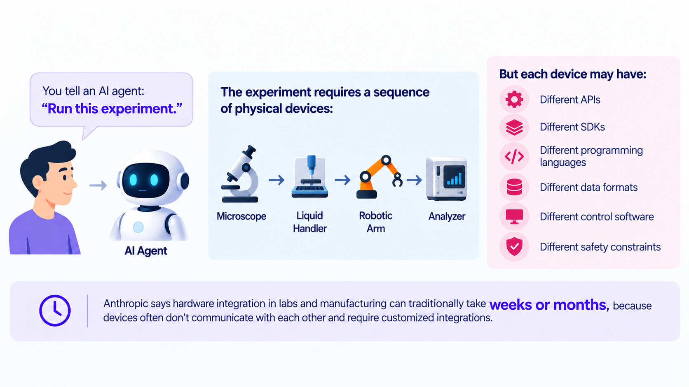
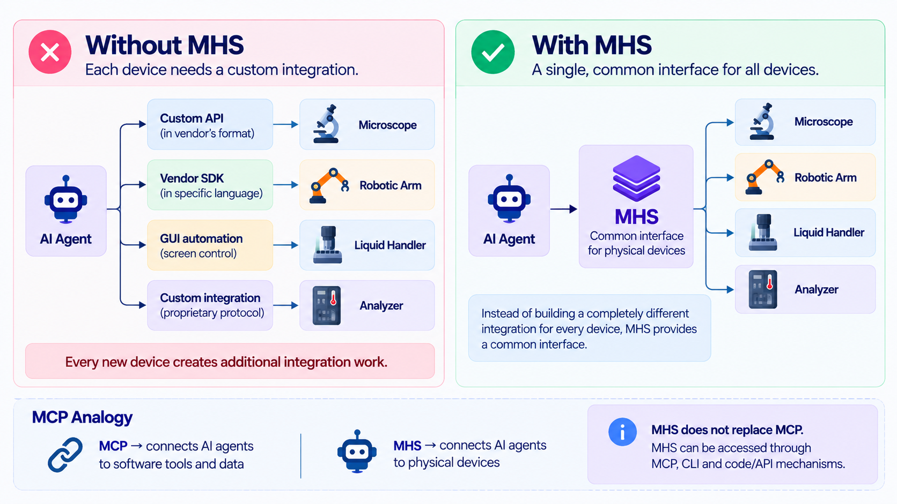

You tell an AI agent:

**Run this experiment.**

The experiment requires:

**Microscope → Liquid Handler → Robotic Arm → Analyzer**

But each device may have:

- Different APIs
- Different SDKs
- Different programming languages
- Different data formats
- Different control software
- Different safety constraints

