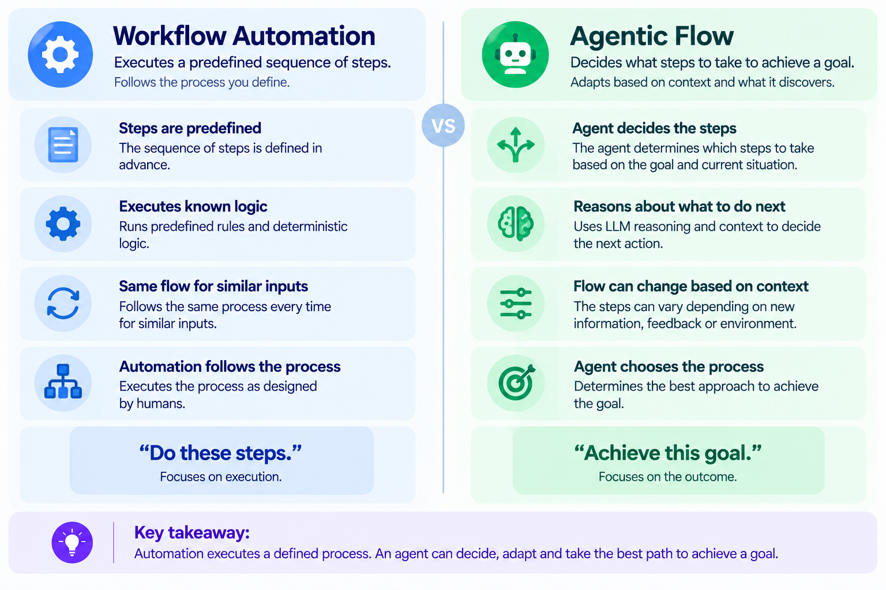
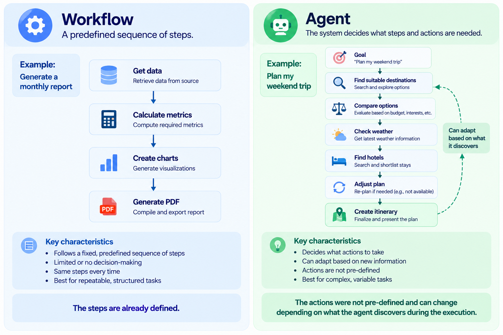

An agent is a system that independently works toward a goal on your behalf.

**The key idea is *independence*: instead of being told exactly what steps to execute, the system can decide what actions are needed to achieve the goal.**

> [!WARNING]
> **Not every automated workflow is an AI agent.**

> [!TIP]
> **Automation can execute a predefined sequence of steps automatically, but an agent can decide what steps to take and adapt them based on what it discovers while pursuing a goal.**

## Example

### Workflow automation:

**"Every Monday, get sales data → calculate metrics → create charts → email the report."**

The system doesn't need to decide what to do. The process is already defined.

### Agentic flow: 

**"Analyze our sales performance and tell me what needs attention."**

The agent may decide to:

**Get sales data → identify anomalies → investigate relevant products → compare with previous periods → determine what matters → produce findings. The exact sequence can change depending on what it discovers.**

## When to build an agent?

| **Build an Agent when...**             | **Why?**                                            |
| -------------------------------------- | --------------------------------------------------- |
| **Complex decision-making**            | Multiple possible paths/actions                     |
| **Rules are difficult to maintain**    | Too many exceptions and conditions                  |
| **Heavy unstructured data**            | Requires contextual reasoning                       |
| **Multiple actions need coordination** | Tasks depend on each other                          |
| **Feedback/adaptation is important**   | The next action depends on what happened previously |

## Choosing Between an Agent, Model, or Tool for a Task

| **Problem** | **What is needed?** | **Classification** |
|---|---|---|
| "Summarize this email." | Generate text | **Model** |
| "Calculate my monthly expenses." | Computation | **Tool** |
| "Find the cheapest flight." | Search + comparison | **Tool** |
| "Plan my complete Japan trip within ₹1.5L." | Search + decisions + coordination + adaptation | **Agent** |
| "Which emails need my attention?" | Read + understand + prioritize | **Agent** |
| "Convert ₹50,000 to JPY." | Deterministic calculation | **Tool** |
| "Create a dinner plan using ingredients at home." | Reason + choose + adapt | **Agent** |

