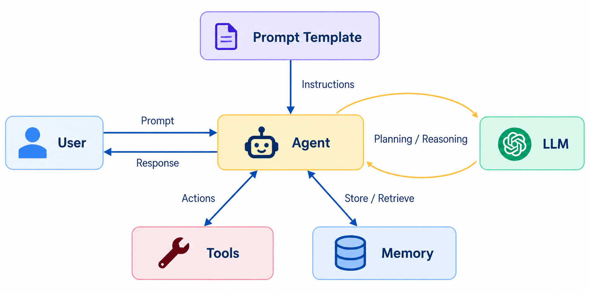
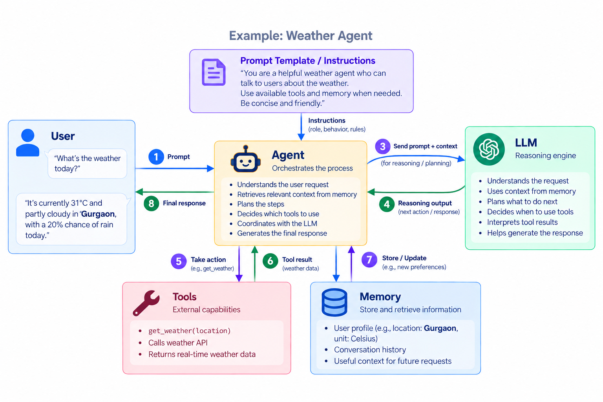
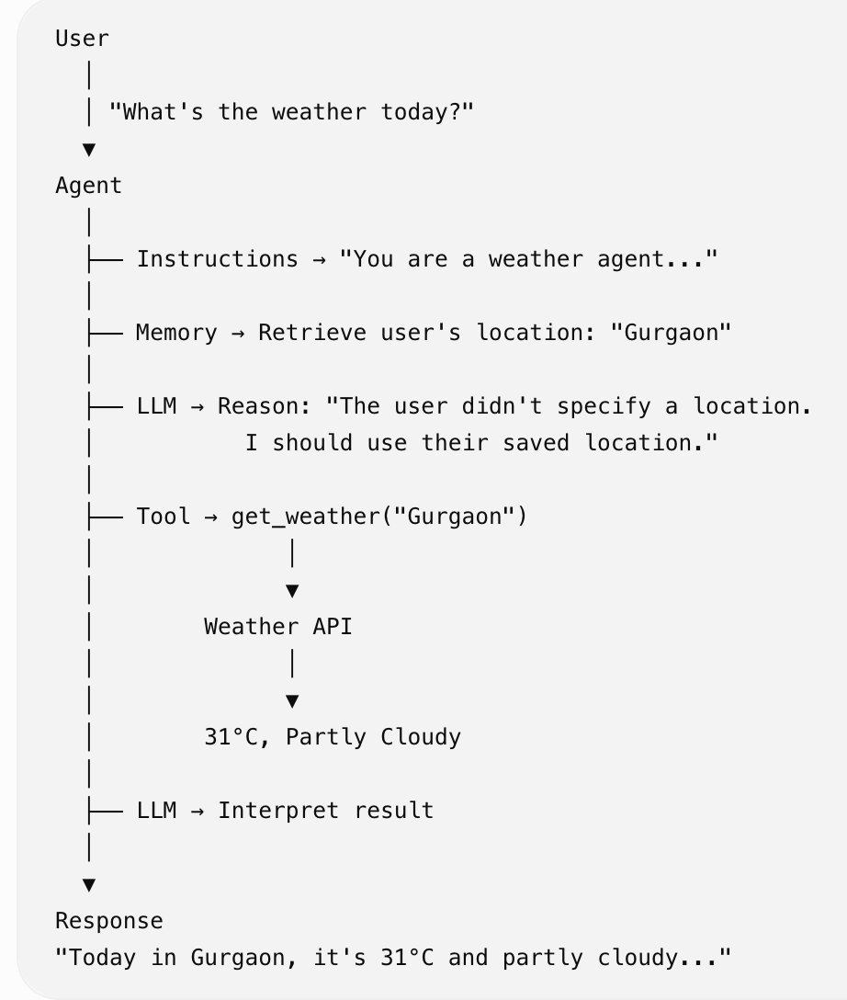

## Architecture of an Agent

Let's take an example of simple Weather agent and understand the role of each component.

## Flow

| **Component** | **Role in Weather Agent** | **Simple mental model** |
|---|---|---|
| **Prompt / Instructions** | Defines how the agent should behave | **Rules** |
| **Agent** | Orchestrates the process and decides what to do | **Decision maker / orchestrator** |
| **LLM** | Reasons about the task and determines next steps | **Brain / reasoning engine** |
| **Tools** | Gets current weather information | **Hands / capabilities** |
| **Memory** | Stores and retrieves useful information | **Context / memory** |

## PRMA Framework:

* The architecture diagram tells us what components an agent has — LLM, tools, memory, instructions, etc.

* PRMA gives us a simpler way to understand what the agent actually does:

**Perceive → Reason → Remember → Act → repeat**

* This is useful because an agent isn't just generating an answer; it observes information, reasons about what to do, uses context, and takes actions toward a goal.

Simple mental model:

> [!TIP]
> **Architecture = What the agent is made of**  
> **PRMA = How the agent operates**

In our Weather agent example-

| **Component** | **What it means** | **Weather Agent example** |
|---|---|---|
| **P — Perception** | Understands the current situation and available information | Receives: “What's the weather today?” |
| **R — Reasoning** | Decides what to do based on the goal and context | “Location isn't specified; use the user's saved location.” |
| **M — Memory** | Retrieves or stores information useful for the task | Retrieves **Gurgaon** as the user's location |
| **A — Action** | Takes an action that changes or interacts with the environment | Calls `get_weather("Gurgaon")` |